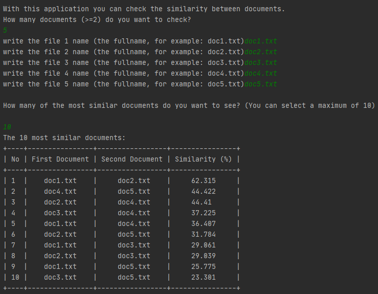

# Document similarity

This is a simple academic project for the course of Principles of Programming Languages and Compilers (6th semester) concerning document similarity using as metric the cosine similarity.

## Description
The user type the names of txt files (at least 2) and the algorithm print the similarity rate of the top k most similar documents (k is given by the user).
Ten documents are given as samples. 

## Python packages

### Python version 
Python 3.8

### Packages
* numpy         (1.18.2)
* scikit-learn  (0.22.2)
* prettytable   (1.0.1)